# Project 1: High Dynamic Range Imaging

- B10902064 張晴昀
- B10902067 黃允謙

## 1. Description of this project

This project involves assembling an HDR image from a series of photographs taken at different exposures. HDR images capture a wider dynamic range and maintain a linear relationship with physical irradiance, making them useful for graphics and vision applications.

## 2. Processing flow

1. Image alignment (Bonus)

2. HDR construction

   - Debevec's method

   - Robertson's method (Bonus)

3. Tone mapping (Bonus)

## 3. Image alignment

We implemented a brute-force version of the Medium Threshold Bitmap (MTB) algorithm 
for image alignment.

The process begins by converting each input image to grayscale and determining 
its median intensity value. This median serves as a threshold to create a binary 
bitmap, where pixels above the threshold are set to $1$, and those below are set 
to $0$.

To align the images, we select the one with the middle exposure as the reference 
and shift the remaining images to minimize their differences with the reference image.

To reduce threshold noise, we also added the mask that excludes pixels with 
grayscale values near the threshold. Specifically, we ignore pixels within the range:

$$ \mathrm{threshold} \pm 2 $$

This approach yields the best results when working with 8-bit grayscale images.

Since we employ a brute-force search for the best alignment, we limit the maximum 
shift to 10 pixels. However, given that the images were captured using a tripod, 
only minor shifts were necessary, and a maximum shift of 10 proved to be more 
than sufficient.

Below are the computed shifts for each image:
```
best shift for image 0: dx = 1, dy = -1
best shift for image 1: dx = 0, dy = 1
best shift for image 2: dx = 1, dy = 0
best shift for image 3: dx = 1, dy = 0
best shift for image 4: dx = 0, dy = 0
best shift for image 5: dx = 0, dy = 0
best shift for image 6: dx = 0, dy = 0
best shift for image 7: dx = 0, dy = 0
best shift for image 8: dx = 0, dy = 0
best shift for image 9: dx = 0, dy = 0
```

Regarding implementation details, when shifting images, we fill in the blank 
areas using nearby pixels as a reasonable approximation. However, this filling 
is only applied during the difference calculation and does not affect the final 
aligned images. Once the optimal shifts are determined, we crop the images to 
remove any artificially introduced pixels. Given that the maximum shift is limited 
to 10 pixels, the cropping ensures that at most 10 pixels are removed from each 
side of the image.

## 4. HDR construction

We implemented two ways to compute responsive curves:

### Debevec's method

Reference: http://www.csie.ntu.edu.tw/~cyy/courses/vfx/papers/Debevec1997RHD.pdf

According to this paper, we wanted to minimize $$O = \sum\limits_{i = 1}^{N}\sum\limits_{j = 1}^{P} \{w(Z_{ij})[g(Z_{ij}) - \ln{E_i} - \ln{\Delta t_j}]\}^2 + \lambda \sum\limits_{z = Z_{min} + 1}^{Z_{max} - 1} [w(z)g''(z)]^2$$.

We first selected sample pixels and obtained $g$ curves for each color channel independently by transforming the objective function into a least-squares problem and solving it.

### Robertson's method

Reference: https://www.csie.ntu.edu.tw/~cyy/courses/vfx/papers/Robertson2003ETA.pdf

This method is aimed at obtaining $\hat{g}, \hat{E_i} = \arg \min\limits_{g, E_i} \sum\limits_{ij} w(Z_{ij})(g(Z_{ij}) - E_i \Delta t_j)^2$.

The process is repeated iteratively until convergence:

- Assume $g(Z_{ij})$ is known:

  Solve for $E_i$ using the equation $E_i = \frac{\sum\limits_{j} w(Z_{ij})g(Z_{ij})\Delta t_j}{\sum\limits_{j} w(Z_{ij})\Delta t_j^2}$.

- Assume $E_i$ is known:

  Solve for $g$ using the equation $g(m) = \frac{1}{|E_m|} \sum\limits_{ij\in E_m} E_i \Delta t_j$

  and then nomorlize $g$ such that $g(128) = 0$.

  (The initial guess for $g$ is chosen as a linear function.)

### Radiance map

After obtaining $g$ for each channel, the next step is to construct the HDR radiance map.

We computed $\ln E_i = \frac{\sum_{j = 1}^{P} w(Z_{ij})(g(Z_{ij}) - \ln \Delta t_j)}{\sum_{j = 1}^{P} w(Z_{ij})}$ for each pixel and we can then recover the radiance $E_i$ for the entire image by exponentiating the result.


## 5. Tone mapping

### Log Min-max Scaling

<table>
<tr>
<td style="width: 50%; vertical-align: top;">
  We first implemented the simple Min-Max normalization. 

  We converted the values of each channel to log space and simply scale it using
  min-max scaling. We use PR1 and PR99 of the values as the lower bound ($lb$) and 
  upper bound ($ub$) to counter outliers. 

  $$
    L_\text{out} = \frac{L_\text{in} - lb}{ub - lb}
  $$

  This simple approach is surprisingly already good enough for us to see the 
  details of both the dark side (the statue) and the bright side (outside of the 
  window).
</td>
<td style="width: 50%; text-align: center;">
  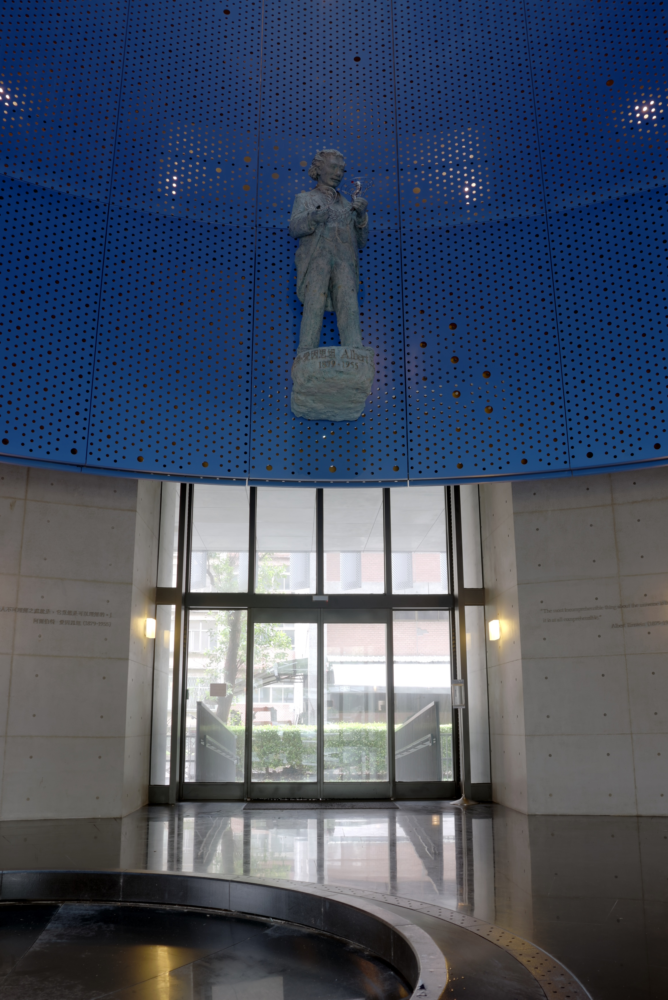
</td>
</tr>
</table>

### Reinhard Method with Split Channel

<table>
<tr>
<td style="width: 50%; vertical-align: top;">
  Next, we implemented the Reinhard tonemapping method.

  For each channel, we first compute the log-average luminance:
  $$
    L_\text{avg} = \exp\left(\log(\delta + L_\text{in})\right)
  $$
  where $\delta$ is set to $10^{-5}$ to avoid logarithm singularities.

  Next, we normalize the input luminance based on this value:
  $$
    L_\text{m} = L_\text{in} \cdot \frac{\alpha}{L_\text{avg}}
  $$
  Here, $\alpha$ is a brightness scaling parameter, which we set to $0.45$.

  Finally, we apply the Reinhard remapping function to compress the luminance 
  into the $[0, 1]$ range. 
  $$
    L_\text{out} = \frac{L_\text{m}}{1 + L_\text{m}} \cdot \frac{1 + L_\text{m}}{L_\text{white}^2}
  $$
  where $L_\text{white}$ controls the maximum distinguishable luminance. Since 
  our scene does not contain extremely bright light sources, we set 
  $L_\text{white} = 30$, effectively disabling this feature.

  In the tone-mapped image, we observe that both bright and dark regions retain 
  visible details. However, compared to the previous method, this approach 
  introduces a yellowish tint, producing a warmer color tone. This effect gives the 
  image a subtle vintage aesthetic.
</td>
<td style="width: 50%; text-align: center;">
  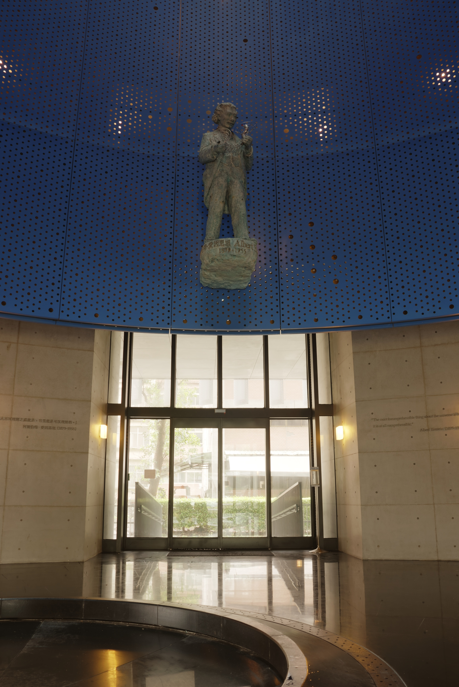
</td>
</tr>
</table>

### Reinhard Method with Split Channel

<table>
<tr>
<td style="width: 50%; vertical-align: top;">
  We then realized that the Reinhard method should be applied to the luminance of 
  the entire image, rather than processing each channel separately. To address 
  this, we implemented an improved version.

  First, we convert the image to grayscale to extract the global luminance and 
  apply the same tone mapping function to scale it into the $[0,1]$ range. We 
  then use this mapped luminance to adjust the color channels proportionally:
  $$
    C_\text{out} = C_\text{in} \cdot \frac{L_\text{out}}{L_\text{in}}
  $$
  where $C_\text{in}$ represents the original color channel values, and 
  $C_\text{out}$is the adjusted output.

  We observed that this approach tends to increase saturation, making the image 
  appear overly vivid. To counter this, we convert the result to HSV color space 
  and reduce the saturation by a factor of $0.8$.

  Compared to the previous methods, this approach not only preserves details in 
  both bright and dark regions but also maintains a more natural color balance. 
  As a result, this became our preferred tone-mapping method.
 </td>
<td style="width: 50%; text-align: center;">
  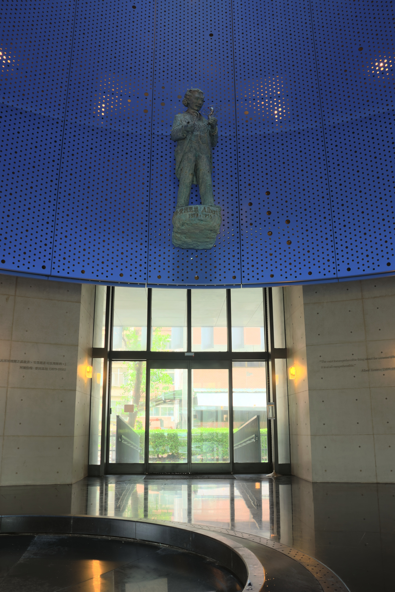
</td>
</tr>
</table>


## 6. Comparison

### Original images

- Folder: `/data/cosmology-hall`

| 1/256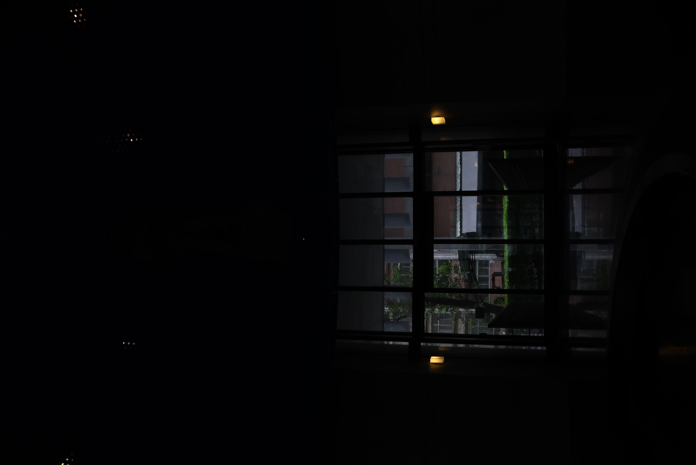   | 1/128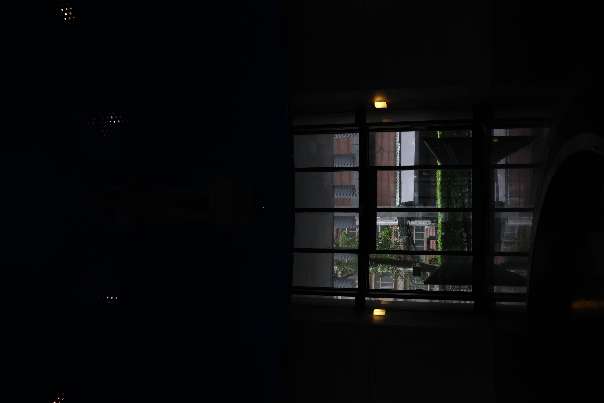   | 1/64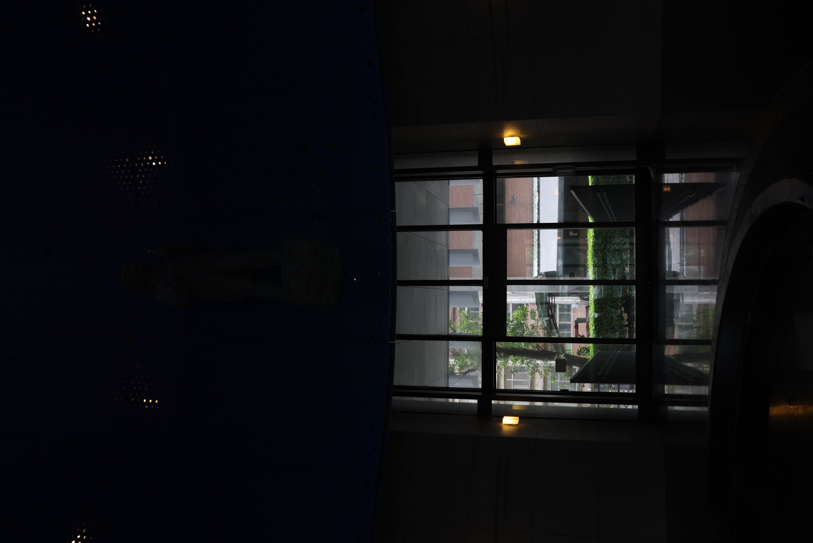    | 1/32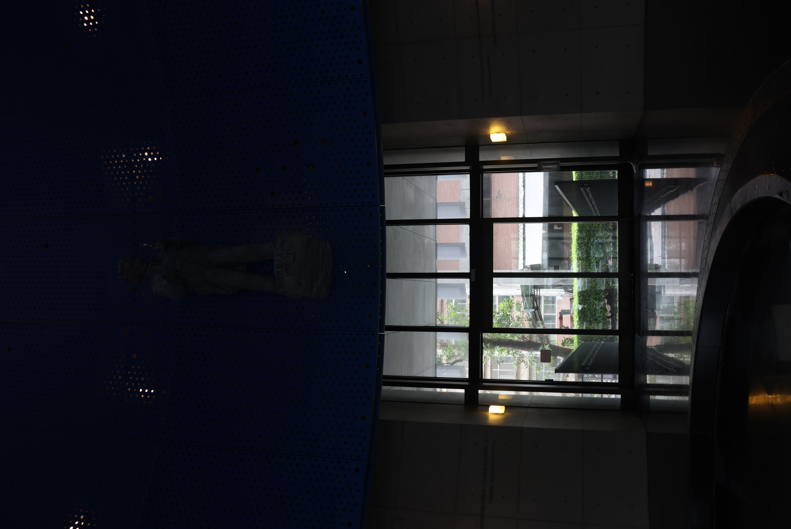  | 1/16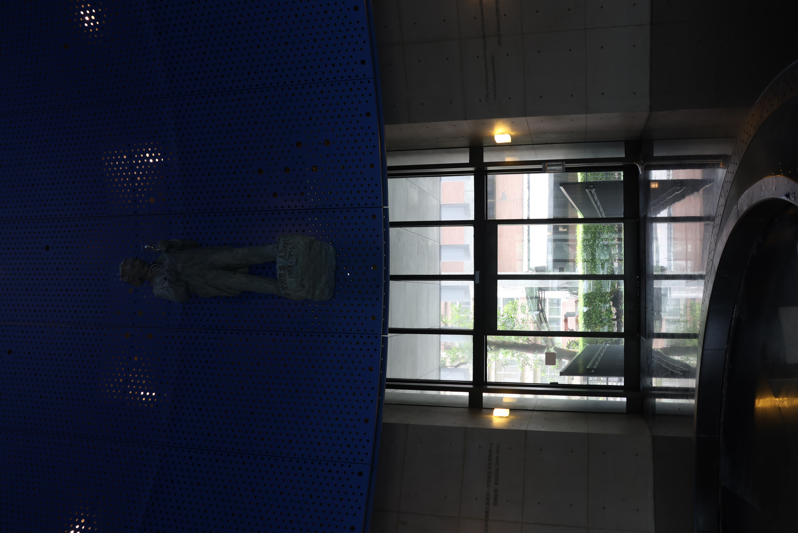  |
| ----------------------------------------------------------- | ----------------------------------------------------------- | ----------------------------------------------------------- | --------------------------------------------------------- | --------------------------------------------------------- |
| **1/8**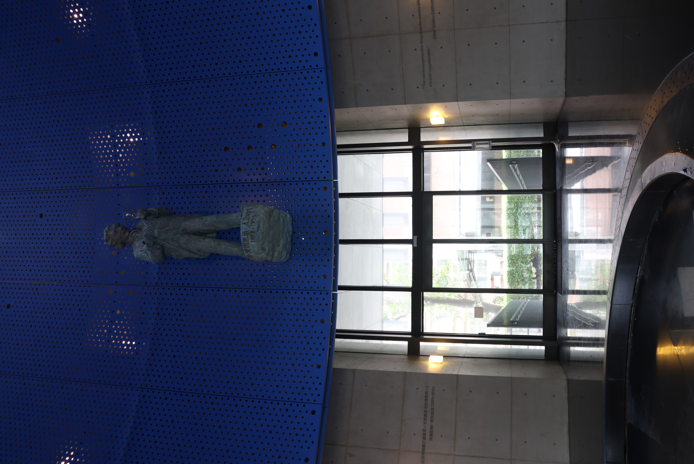 | **1/4**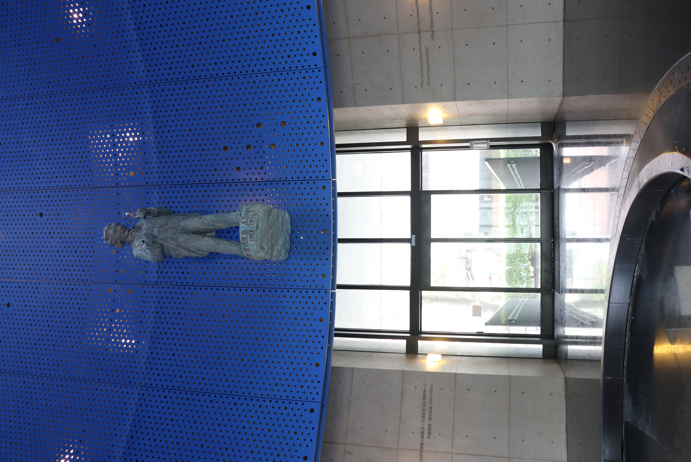 | **1/2**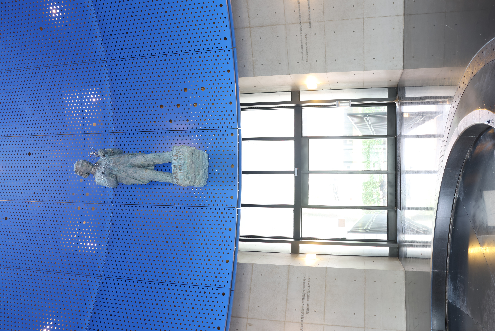 | **1**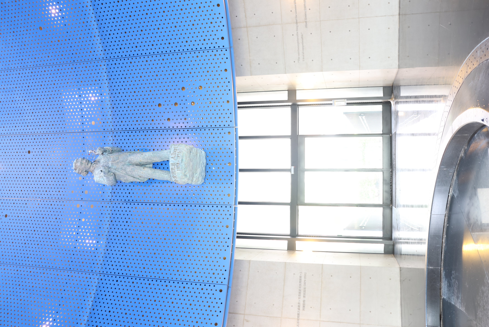 | **2**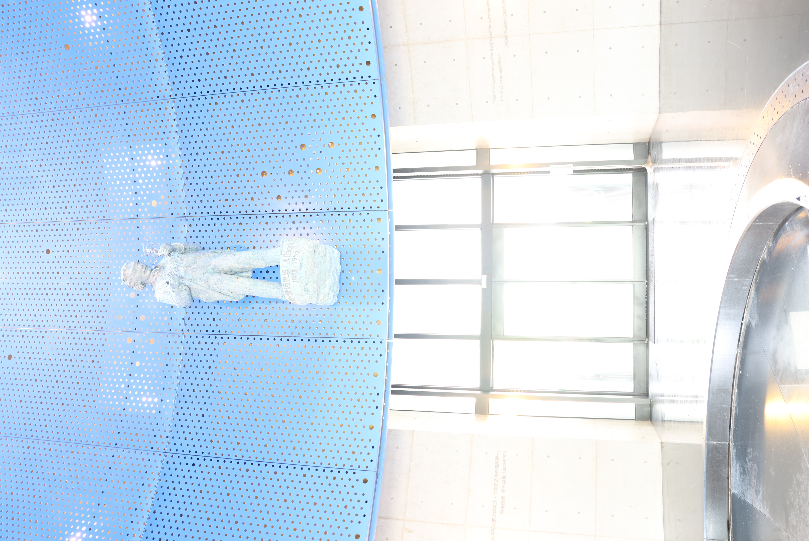 |

### Result

- Folder:

## 7. Usage